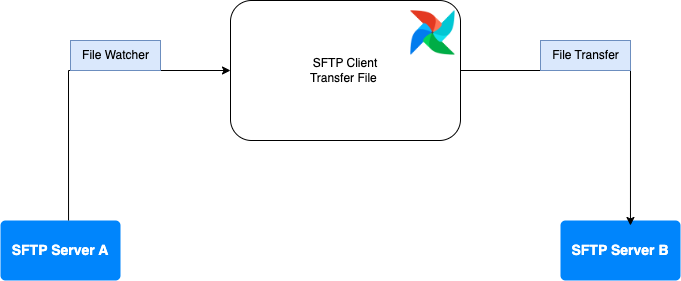

# Cake Assessment Data Engineer
Test: “ Có 2 hệ thống SFTP gọi là A và B.

 

Thiết kế 1 pipeline chuyển dữ liệu các file mới đc sinh ra từ server SFTP A sang server SFTP B mà giữ nguyên cấu trúc thư mục.

Dữ liệu chỉ đi từ A -> B, dữ liệu xóa ở A thì ko đc xóa ở B.

Công nghê sử dụng : Airflow chạy trên nền Docker.

Ví dụ :

Ngày 2022/22/11 trên server A xuất hiện sftp_A://a/b/c/file_1.txt thì chuyển sang server B sftp_B://a/b/c/file_1.txt

Ngày 2022/23/11 trên server A xuất hiện sftp_A://a/b/c/file_2.txt thì chuyển sang server B sftp_B://a/b/c/file_2.txt

Ngày 2022/24/11 trên server A xuất hiện sftp_A://a/b/c/file_3.txt thì chuyển sang server B sftp_B://a/b/c/file_3.txt “

## Flow Design

## Setup 

## How To Run

