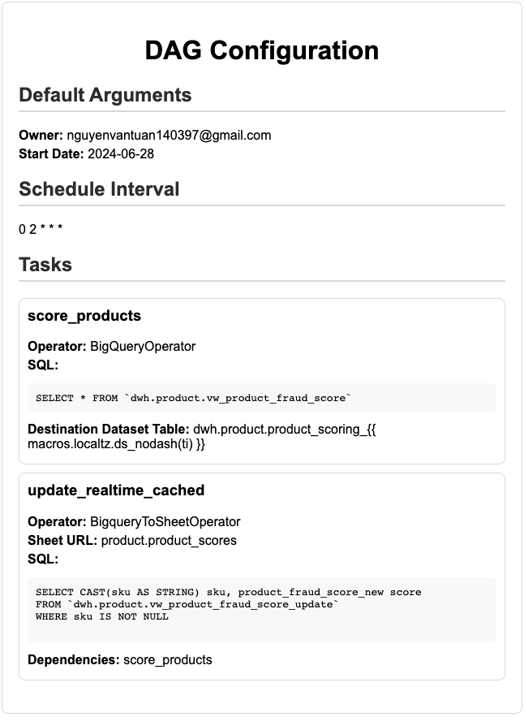

# Airlake Dag Factory
Dynamically build Airflow DAGs from YAML files

**Airlake Factory Tool**




## Install Airlake Factory Package

**Must Have**
```
export PYTHONPATH=$PYTHONPATH:/airfactory
```
**Run Test**
```
make test
```
## Build Lib
```
make dist
```
## Usage This Lib
**Copy airfactory-1.0.0.tar.gz in dist folder to your project**
**Configure requirements.txt**
```
./packages/airfactory-1.0.0.tar.gz
```

**How To Work**

1. Create a YAML configuration file called config_file.yml and save it within your dags folder:
```yaml
default_args:
  owner: nguyenvantuan140397@gmail.com
  start_date: 2024-06-28
schedule: "0 2 * * *"
tasks:
  score_products:
    operator: BigQueryOperator
    sql: SELECT * FROM `dwh.product.vw_product_fraud_score`
    destination_dataset_table: "dwh.product.product_scoring_{{ macros.localtz.ds_nodash(ti) }}"

  update_realtime_cached:
    operator: BigqueryToSheetOperator
    sheet_url: "product.product_scores"
    sql: |
      SELECT CAST(sku AS STRING) sku, product_fraud_score_new score
      FROM `dwh.product.vw_product_fraud_score_update`
      WHERE sku IS NOT NULL
    dependencies: ["score_products"]
```
2. In the same folder, create a python file called generate_dags.py. This file is responsible for generating the DAGs from the configuration file and is a one-time setup. You won't need to modify this file unless you want to add more configuration files or change the configuration file name.
```python
'''
Generated by Airflow Datalake! Do not edit!
author: tuancamtbtx
Timestamp 2024-07-19T17:09:31.157517+07:00
'''

from airflow import DAG

from airfactory.render import load_dag

conf = {'schedule_interval': '0 0 * * *', 'timetable': {'start_date': '2021-01-01', 'end_date': '2021-01-02'}, 'default_args': {'owner': 'airflow', 'depends_on_past': False, 'email_on_failure': False, 'email_on_retry': False, 'retries': 1}, 'tasks': {'task1': {'operator': 'airflow.operators.bash.BashOperator', 'bash_command': 'echo 1', 'execution_timeout': 60, 'sla': 30}, 'task2': {'operator': 'airflow.operators.bash.BashOperator', 'bash_command': 'echo 2', 'execution_timeout': 60, 'sla': 30}}}
name = 'test_dag'
load_dag(globals(), name, conf)
```

## Benefits
- Construct DAGs without knowing Python
- Construct DAGs without learning Airflow primitives
- Avoid duplicative code
- Everyone loves YAML! ;)